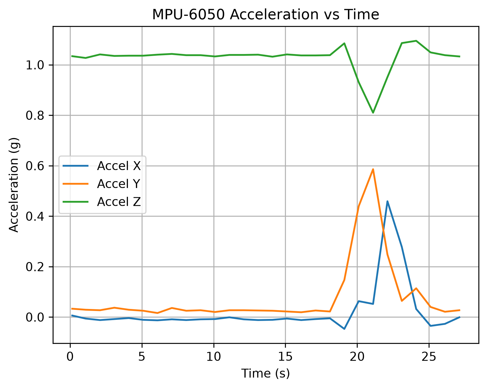
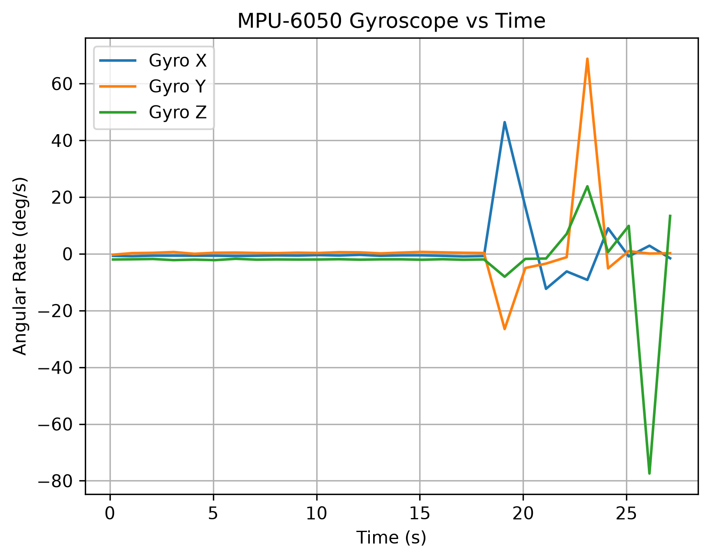

# ESP32 CAN-Based Distributed IMU and Fault-Monitoring System

A two-node embedded system built with ESP32 microcontrollers, SN65HVD230 CAN transceivers, and an MPU-6050 IMU. The system transmits six-axis motion telemetry over a physical CAN bus, distinguishes sensor faults from node or link failures, and logs the received data to CSV for Python analysis and visualization.

## Project Highlights

- Two ESP32 nodes communicating over Classical CAN at **125 kbps**
- Three CAN message types for acceleration, heartbeat/status, and gyroscope data
- Six-axis MPU-6050 telemetry transmitted as signed 16-bit values
- CAN identifier and payload-length validation
- Sequence monitoring with correct `255 -> 0` rollover behavior
- Separate data-frame and heartbeat timeout detection
- MPU I2C acknowledgment and complete-read validation
- Sensor failure isolated from node or CAN-link failure
- Automatic fault and recovery reporting
- Python serial logger with timestamped CSV output
- Pandas summary statistics and Matplotlib plots
- Physical CAN termination verified with a digital multimeter

## System Architecture

```text
MPU-6050
   |
   | I2C
   v
ESP32 Sensor Node
   |
   | TWAI TX/RX
   v
SN65HVD230  <==== CANH / CANL ====>  SN65HVD230
                                         |
                                         | TWAI TX/RX
                                         v
                                  ESP32 Monitor Node
                                         |
                                         | USB Serial
                                         v
                                  Python Logger / CSV
                                         |
                                         v
                                Pandas + Matplotlib
```

### Sensor Node

The sensor node:

- Wakes and reads the MPU-6050 over I2C
- Requests the full 14-byte accelerometer, temperature, and gyroscope register block
- Verifies the I2C acknowledgment status
- Verifies that all 14 expected bytes were received
- Packs signed 16-bit acceleration and gyroscope measurements into CAN payloads
- Transmits acceleration data on CAN ID `0x100`
- Transmits heartbeat and sensor-health status on CAN ID `0x101`
- Transmits gyroscope data on CAN ID `0x102`
- Stops sending invalid sensor data during an MPU fault
- Continues transmitting heartbeat messages while the ESP32 and CAN link remain operational
- Automatically resumes telemetry when valid MPU communication returns

### Monitor Node

The monitor node:

- Receives and validates CAN frames
- Checks CAN identifiers and data-length codes
- Reconstructs signed 16-bit sensor values from high and low bytes
- Converts acceleration to `g`
- Converts angular rate to degrees per second
- Checks acceleration-frame sequence continuity
- Detects data-frame timeouts
- Detects heartbeat timeouts
- Reports sensor-health state received over CAN
- Reports recovery when communication resumes
- Sends structured telemetry to the host computer over USB serial

## Hardware

- 2 x ESP-WROOM-32D development boards
- 2 x Waveshare SN65HVD230 3.3 V CAN transceiver boards
- 1 x MPU-6050 accelerometer and gyroscope module
- Breadboards and jumper wires
- Twisted-pair wiring for CANH and CANL
- Shared ground between nodes
- Digital multimeter

## Pin Assignments

### CAN / TWAI

| Signal | ESP32 Pin |
|---|---:|
| CAN TX | GPIO 25 |
| CAN RX | GPIO 26 |

### MPU-6050 I2C

| Signal | ESP32 Pin |
|---|---:|
| SDA | GPIO 21 |
| SCL | GPIO 22 |
| VCC | 3.3 V |
| GND | GND |

## Physical CAN Connections

Each ESP32 connects to one SN65HVD230 transceiver:

| ESP32 | SN65HVD230 |
|---|---|
| 3.3 V | 3.3 V |
| GND | GND |
| GPIO 25 | CAN TX |
| GPIO 26 | CAN RX |

The two transceiver modules connect as follows:

| Sensor Node | Monitor Node |
|---|---|
| CANH | CANH |
| CANL | CANL |
| GND | GND |

Each Waveshare transceiver board includes a 120-ohm termination resistor. With both nodes connected and unpowered, the measured resistance between CANH and CANL was approximately **58-60 ohms**, consistent with two 120-ohm resistors in parallel.

## CAN Configuration

- CAN mode: Classical CAN
- ESP32 peripheral: TWAI
- Bit rate: `125 kbps`
- Identifier type: Standard 11-bit
- Maximum payload: 8 bytes
- Current update period: approximately 1 second

The 125 kbps value is the bus bit rate, not the measurement update rate. The firmware currently transmits one acceleration frame, one gyroscope frame, and one heartbeat frame approximately once per second.

## CAN Message Map

### Acceleration Frame - ID `0x100`

Payload length: **7 bytes**

| Byte | Field |
|---:|---|
| 0 | Acceleration sequence counter |
| 1 | Accel X high byte |
| 2 | Accel X low byte |
| 3 | Accel Y high byte |
| 4 | Accel Y low byte |
| 5 | Accel Z high byte |
| 6 | Accel Z low byte |

### Heartbeat and Status Frame - ID `0x101`

Payload length: **2 bytes**

| Byte | Field |
|---:|---|
| 0 | Heartbeat sequence counter |
| 1 | Sensor-health status |

| Status | Meaning |
|---:|---|
| `1` | MPU sensor healthy |
| `0` | MPU sensor fault active |

### Gyroscope Frame - ID `0x102`

Payload length: **7 bytes**

| Byte | Field |
|---:|---|
| 0 | Gyroscope sequence counter |
| 1 | Gyro X high byte |
| 2 | Gyro X low byte |
| 3 | Gyro Y high byte |
| 4 | Gyro Y low byte |
| 5 | Gyro Z high byte |
| 6 | Gyro Z low byte |

## Binary Packing and Reconstruction

The MPU-6050 measurements are signed 16-bit integers, while each CAN payload slot contains 8 bits. Each measurement is split into a high byte and low byte.

### Sensor-node packing

```cpp
txFrame.data[1] = accelX >> 8;
txFrame.data[2] = accelX & 0xFF;
```

### Monitor-node reconstruction

```cpp
int16_t accelX =
    (rxFrame.data[1] << 8) | rxFrame.data[2];
```

`0xFF` is an 8-bit mask that preserves the low byte. Bitwise OR combines the shifted high byte and low byte into the original signed 16-bit value.

## Sensor Conversion

The current firmware uses the MPU-6050 default measurement ranges.

### Accelerometer

Default range: `+/-2 g`

```text
16384 counts/g
```

```cpp
float accelX_g = accelX / 16384.0f;
```

When the module is lying approximately flat, the readings are typically near:

```text
Accel X: 0 g
Accel Y: 0 g
Accel Z: +1 g
```

### Gyroscope

Default range: `+/-250 deg/s`

```text
131 counts/(deg/s)
```

```cpp
float gyroX_dps = gyroX / 131.0f;
```

A stationary sensor reads near zero degrees per second with normal bias and noise. Rotating the board produces a larger positive or negative value on the corresponding axis.

## Fault Detection and Recovery

### I2C Acknowledgment Check

```cpp
uint8_t i2cStatus = Wire.endTransmission(false);
```

A value of zero means the MPU acknowledged the register request.

### Complete-Read Check

```cpp
uint8_t bytesReceived = Wire.requestFrom(MPU_ADDR, 14);
```

The sample is accepted only when:

```cpp
bytesReceived == 14
```

### Sensor Fault Behavior

During an MPU failure:

- Acceleration frames stop
- Gyroscope frames stop
- Heartbeat frames continue
- Heartbeat status changes to fault
- The monitor reports a data-frame timeout
- The monitor does not report a heartbeat timeout while the node and CAN link remain active

This distinguishes a failed sensor from a failed embedded node or CAN path.

### Node or CAN-Link Failure

If the sensor node or CAN connection fails:

- Acceleration frames stop
- Gyroscope frames stop
- Heartbeat frames stop
- The monitor reports both data-frame and heartbeat timeouts

### Automatic Recovery

When communication returns:

- Sensor telemetry resumes automatically
- Sensor health returns to healthy
- The sensor node reports recovery
- The monitor reports data-frame or heartbeat recovery as applicable

No manual reset is required.

## Sequence Monitoring

The acceleration and gyroscope frames include independent unsigned 8-bit sequence counters.

```text
0 through 255
```

Normal rollover:

```text
254 -> 255 -> 0 -> 1
```

The monitor validates acceleration-frame continuity:

```cpp
uint8_t expectedCounter = lastCounter + 1;

if (rxFrame.data[0] != expectedCounter) {
    Serial.println("ERROR DETECTED");
}
```

The rollover from 255 to 0 is handled correctly because both values use `uint8_t` arithmetic.

## Python Data Pipeline

### Logger

`Python-Analysis/can_logger.py`:

- Opens the monitor node USB serial port
- Reads serial lines continuously
- Parses acceleration and gyroscope values
- Groups six-axis measurements into complete samples
- Adds elapsed-time timestamps
- Writes samples to `imu_log.csv`
- Flushes each row to disk immediately

CSV columns:

```text
time_s
accel_x
accel_y
accel_z
gyro_x
gyro_y
gyro_z
```

### Analysis

`Python-Analysis/analyze_imu.py`:

- Loads the CSV with pandas
- Prints the first rows with `head()`
- Calculates descriptive statistics with `describe()`
- Plots acceleration versus time
- Plots gyroscope angular rate versus time
- Exports high-resolution PNG figures

## Data Results

### Acceleration



The acceleration plot shows the sensor remaining mostly stationary, with the Z axis near 1 g, followed by a motion event where gravity and linear acceleration are redistributed across the three axes.

### Gyroscope



The gyroscope plot shows low stationary angular-rate values followed by larger positive and negative rotational events during manual movement of the sensor.

## Validation Tests

| Test | Expected Behavior | Result |
|---|---|---|
| ESP32 startup | Both nodes initialize successfully | Passed |
| CAN termination | Approximately 60 ohms between CANH and CANL | Passed |
| Acceleration transmission | `0x100` frames received and decoded | Passed |
| Heartbeat transmission | `0x101` frames received continuously | Passed |
| Gyroscope transmission | `0x102` frames received and decoded | Passed |
| Counter rollover | `255 -> 0` without false sequence error | Passed |
| Sensor-node disconnect | Data and heartbeat timeout | Passed |
| Sensor-node reconnect | Automatic recovery | Passed |
| MPU disconnect | Data stops, heartbeat continues, fault status active | Passed |
| MPU reconnect | Telemetry and healthy status recover automatically | Passed |
| Motion response | Accel and gyro axes respond to movement | Passed |
| Python logging | Timestamped CSV file generated | Passed |
| Python analysis | Statistics and plots generated | Passed |

## Notable Debugging Work

### Duplicate CAN Frames

An early version called `ESP32Can.writeFrame()` twice per loop: once directly and once inside an `if` statement. Because the function performs a transmission, each sequence value was sent twice. The sequence checker exposed the issue, and the code was corrected to call the function only once while checking its return value.

### CAN Acknowledgment Behavior

When only the transmitting node was powered, messages filled the transmit queue because no receiving CAN controller was available to acknowledge them. Powering the monitor node restored normal acknowledged communication.

### C++ Variable Scope

Sensor measurements were initially declared inside an I2C-success block but referenced later during CAN packing. They were moved to loop-wide scope and assigned only when the read was valid.

## Repository Structure

```text
esp32-can-fault-monitor/
├── README.md
├── Firmware/
│   ├── sensor_node.cpp
│   └── monitor_node.cpp
├── Python-Analysis/
│   ├── can_logger.py
│   ├── analyze_imu.py
│   └── imu_log.csv
├── data-plots/
│   └── acceleration_plot.png
├── Data-Plots/
│   └── gyroscope_plot.png
└── Outputs/
    └── SensorNodeOutput.png
```

## Running the Project

### Firmware

1. Install the ESP32 Arduino core.
2. Install the `ESP32-TWAI-CAN` library.
3. Upload `Firmware/sensor_node.cpp` to the sensor-node ESP32.
4. Upload `Firmware/monitor_node.cpp` to the monitor-node ESP32.
5. Confirm both nodes use 125 kbps CAN configuration.
6. Close Arduino Serial Monitor before starting the Python logger.

### Python Logger

Install dependencies:

```bash
py -m pip install pyserial pandas matplotlib
```

Update the COM port near the top of `can_logger.py` to match the monitor node, then run:

```bash
py can_logger.py
```

Stop logging with `Ctrl+C`.

### Python Analysis

Run from the directory containing `imu_log.csv`:

```bash
py analyze_imu.py
```

The script prints summary statistics and generates acceleration and gyroscope plots.

## Software and Tools

### Embedded

- Arduino IDE
- C/C++
- ESP32 Arduino core
- ESP32 TWAI peripheral
- `ESP32-TWAI-CAN`
- Arduino `Wire` library

### Python

- Python 3
- pyserial
- pandas
- Matplotlib

### Hardware Validation

- Digital multimeter
- Breadboard prototyping
- Differential CAN wiring
- Termination-resistance measurement

## Current Limitations

- Sensor updates currently occur approximately once per second
- Scheduling uses `delay(1000)` rather than nonblocking periodic scheduling
- Accelerometer and gyroscope use assumed default MPU-6050 ranges
- No sensor calibration is currently applied
- No digital filtering is currently applied
- Temperature is read but not transmitted
- The monitor validates acceleration sequence continuity but does not separately validate gyro sequence continuity
- The monitor does not currently implement a separate gyroscope timeout
- The heartbeat status uses a simple healthy/fault value rather than a multi-bit status field
- The Python serial port is configured manually
- The prototype uses breadboards and jumper wiring rather than a custom PCB

## Future Improvements

- Replace `delay()` with `millis()`-based scheduling or FreeRTOS tasks
- Increase the IMU sample rate
- Add accelerometer and gyroscope calibration
- Add low-pass filtering
- Add gyroscope sequence and timeout supervision
- Expand the status byte into a bitfield
- Add temperature telemetry
- Add persistent fault counters
- Add command and configuration frames over CAN
- Accept the serial port as a Python command-line argument
- Add graceful serial and CSV cleanup on `Ctrl+C`
- Design a custom PCB
- Add additional CAN sensor nodes

## Skills Demonstrated

- Embedded C/C++
- ESP32 firmware development
- CAN/TWAI communication
- CAN physical-layer integration
- I2C register access
- Binary serialization and deserialization
- Bit shifting and masking
- Sequence and heartbeat supervision
- Timeout and recovery logic
- Sensor fault isolation
- Failure injection and validation
- Python serial communication
- CSV data logging
- Pandas data analysis
- Matplotlib visualization
- Hardware debugging with a multimeter
- Technical documentation

## Project Summary

This project demonstrates a complete embedded telemetry pipeline: an MPU-6050 is read over I2C by an ESP32 sensor node, six-axis measurements are validated and serialized into CAN frames, a second ESP32 reconstructs and monitors the data, communication and sensor faults are classified using heartbeat and timeout logic, and Python software logs and analyzes the resulting telemetry.
